# CinemaMAK
## Spis treści
* [Skład](#skład)
* [Technologie](#technologie)
* [Opis projektu](#opis-projektu)
* [Model obiektowy](#model-obiektowy)
* [Schemat bazy danych](#schemat-bazy-danych)
* [Widoki](#widoki)
* [Instalacja](#instalacja)
* [Uruchomienie](#uruchomienie)

<a name="skład"></a>
## Skład
- Skowron Mateusz
- Chrobot Adrian
- Wilk Karol

<a name="technologie"></a>
## Technologie
- Java
- Gradle
- Spring Framework
- JavaFX
- PostgreSQL
- Docker

<a name="opis-projektu"></a>
## Opis projektu
Projekt jest to aplikacja desktopowa udostępniająca system do obsługi multipleksu kinowego. 
Użytkownik może posiadać jedną z trzech ról: Administrator, Menadżer lub Pracownik. 
W zależności od tego ma on odpowiednie funkcje w systemie i dostęp do odpowiednich widoków.\
Funkcjonalności:
- Zarządzanie bazą filmów
- Planowanie seansów
- Sprzedawanie biletów
- Tworzenie rekomendacji dla filmów
- Wyświetlanie statystyk
- Wysyłanie wiadomości e-mail z powiadomieniami do pracowników
- Zarządzanie użytkownikami systemu

Do cześci frontendowej apliakacji została wykorzystana JavaFX, a odpowiednie widoki zaimplementowane w postaci plików FXML.
Część backendowa została zaimplementowana przy użyciu Javy oraz Spring Framework'a.
Dane przechowywane są w relacyjnej bazie danych. Jako system do zarządzania relacyjną bazą danych wybrano jeden z popularniejszych systemów - PostgreSQL.
Automatyzacje procesu kompilacji zapewnia wykorzystanie Gradle'a.

<a name="model-obiektowy"></a>
## Model obiektowy
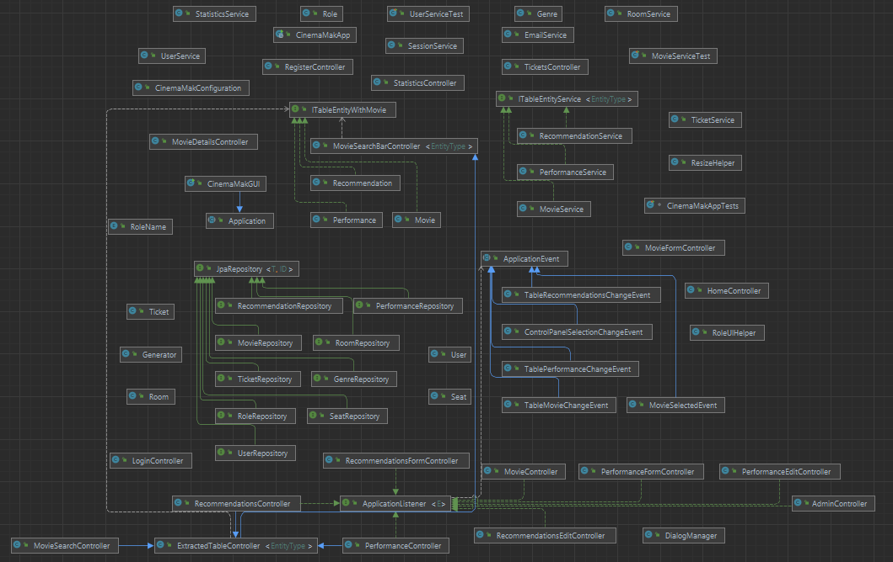

Warstwa persystencji realizowana jest poprzez JPA (wzorzec Repository).

Obiekty `Repository` (`UserRepository`, `RoleRepository`, `MovieRepository`, `GenreRepository`, `TicketRepository`, `PerformanceRepository`, `RoomRepository`, `SeatRepository`, `RecommendationRepository`) udostępniają poprzez JPA kwerendy, których wynikami są encje i kolekcje encji.

Obiekty `Service` korzystają z funkcjonalności obiektów `Repository` i udostępniają bardziej ograniczone i złożone API w celu wprowadzenia warstwy abstrakcji pomiędzy kontrolerami i warstwą persystencji. Warto zauważyć, że niektóre obiekty `Service` obsługują więcej niż jeden obiekt `Repository`. Dzieje się tak, kiedy `Repository` ma znaczenie jedynie w kontekscie innej encji (np. encje `Role` mają znaczenie jedyne w konteksie encji `User`).

Następna warstwa aplikacji składa się z obiektów `Controller`, które realizują funkcjonalność warstwy kontrolerów we wzorcu MVC. Korzystając z obiektów `Service` realizują wysokopoziomową logikę biznesową. W szczególności można wyróżnić trzy główne typy kontrolerów:

- Kontrolery sesji i uwierzytelniania, odpowiedzialne za rejestrację/logowanie
- Kontrolery administracyjne, dostępne jedynie dla Admina/Menedżera, pozwalające na modyfikację danych
- Kontrolery wyświetlania, dostępne dla zwykłego pracownika. Nie pozwalają one na wprowadzanie zmian. Wyjątkiem jest kontroler `TicketController`, który pracownikowi pozwala na rejestrację sprzedaży biletów.

Każdemu kontrolerowi przypada odpowiedni widok - są to widoki `FXML` z biblioteki JavaFX, pozwalające na imlpementację reaktywnego GUI poprzez powiązania `Binding` JavaFX.

<a name="schemat-bazy-danych"></a>
## Schemat bazy danych
Ze względu na potrzebę zapewnienia wszystkich potrzebnych informacji, które zostaną wykorzystane do statystyk
oraz są niezbędne do poprawnego działania systemu, zgodnie z wymaganiami, w bazie znalazły się następujące tabele:


- **Roles** - Pełni funkcję słownika. Zawiera role użytkowników występujące w systemie. \
  Dane znajdujące się w tabeli wczytywane są z pliku *roles.txt* przy starcie aplikacji. \
  W trakcie działania aplikacji nie będzie możliwości dodania innych ról, gdyż muszą być one wcześniej zdefiniowane, aby aplikacja działała poprawnie.


- **Genres** - Pełni funkcję słownika. Zawiera gatunki filmów występujące w systemie. \
  Dane znajdujące się w tabeli wczytywane są z pliku *genres.txt* przy starcie aplikacji.\
  W trakcie działania aplikacji będzie możliwość dodania innych gatunków do tabeli.


- **Users** - Zawiera dane użytkowników systemu. \
  Klucz obcy *role_id* wskazuje rekord z tabeli roles, definiuje rolę użytkownika w systemie.


- **Movies** - Zawiera dane filmów, które były/będą transmitowane w kinie. \
  Klucz obcy *genre_id* wskazuje rekord z tabeli genres, definiuje gatunek filmu.


- **Rooms** - Zawiera sale kinowe, które znajdują sie w placówce kina.


- **Seats** - Zawiera miejsca dostępne w kinie. \
  Klucz obcy *room_id* wskazuje rekord z tabeli rooms, definiuje to, w której sali kinowej znajduję się dane miejsce.


- **Performances** - Zawiera dane seansów, które odbyły/odbędą się w kinie. \
  Klucz obcy *movie_id* wskazuje rekord z tabeli movies, definiuje to, jaki film był/będzie transmitowany na danym seansie. \
  Klucz obcy *room_id* wskazuje rekord z tabeli rooms, definiuje to, w jakiej sali odbył/odbędzie się seans. \
  Klucz obcy *supervisor_id* wskazuje rekord z tabeli users, definiuje to, który pracownik pełni opiekę nad danym seansem.


- **Recommendations** - Zawiera polecenia, które były/będą w danych dniach. \
  Klucz obcy *movie_id* wskazuje rekord z tabeli movies, definiuje to, który film był/będzie polecany w danej rekomendacji.


- **Tickets** - Zawiera bilety, na dane seanse. \
  Klucz obcy *performance_id* wskazuje rekord z tabeli performances, definiuje to, na był/jaki seans jest dany bilet.
  Klucz obcy *seat_id* wskazuje rekord z tabeli seats, definiuje to, które miejsce zostało zarezerwowane.

<a name="widoki"></a>
## Widoki
- **Logowanie**

  

  Widok umożliwia logowanie się do systemu. \
  Należy podać poprawny adres email w pierwszym polu formularza oraz hasło w drugim. \
  Po podaniu niepoprawnych danych pojawa się wyskakującę okno blokujące działanie aplikacji w tle,
  informującę o błędzie. Po jego zamknięciu możliwa jest kolejna próba logowania. \
  Po poprawnym zalogowaniu zostajemy przeniesieni do głównego okna aplikacji. \
  Przycisk *Sign In* zatwierdza formularz. \
  Przycisk *Don't have an account? Sign up* umożliwia przejścia do okna rejestracji użytkownika.


- **Rejestracja**

  

  Widok umożliwia założenie konta w systemie. \
  Po podaniu niepoprawnych lub niekompletnych danych pojawa się wyskakującę okno blokujące działanie aplikacji w tle,
  informującę o błędzie. Po jego zamknięciu możliwa jest kolejna próba rejestracji. \
  Po poprawnym utworzeniu konta zostajemy przeniesieni do okna logowania. \
  Przycisk *Sign Up* zatwierdza formularz.\
  Przycisk *Already have an account? Sign in* umożliwia przejścia do okna logowania.


- **Widok główny aplikacji**

  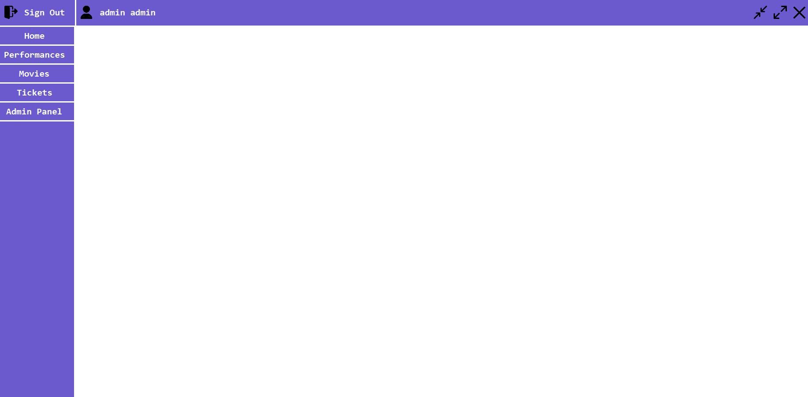

  W górnym lewym rogu za pomocą przycisku *Sign out* możemy się wylogować. \
  Obok przycisku służącego do wylogowywania widoczny jest aktualnie zalogowany użytkownik. \
  Po lewej stronie widoku znajduje się panel boczny, za pomocą którego możemy przełączać widoki.
  

- **Filmy**

  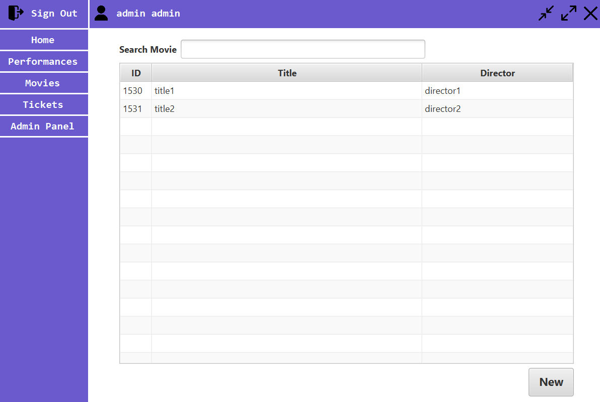

  Widok dostępny jest dla użytkowników z rolą admina/menadżera. \
  W tabeli wyświetlane są filmy obecnie znajdującę się w bazie. \
  W górnej części widoku znajduje się pole tekstowe, w którym możemy wyszukać film po tytule lub reżyserze. \
  Po dwukrotnym wciśnięciu danego rekordu wyświetla się widok szczegółowych danych o filmie. \
  Po kliknięciu w przycisk *NEW* otwiera się formularz dodawania nowego filmu. 

  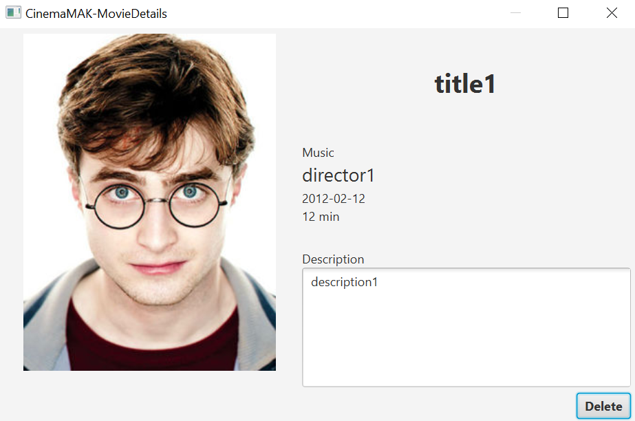
  
  Za pomocą przycisku *Delete* możemy usunąć film.

  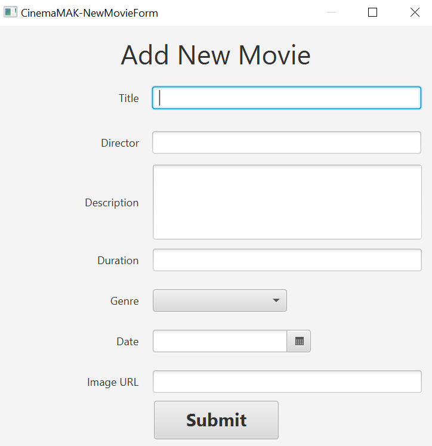

  Po poprawnym uzupełnieniu danych i wciśnięciu przycisku *Submit* film zostaje dodany do bazy danych. 


- **Seanse**

  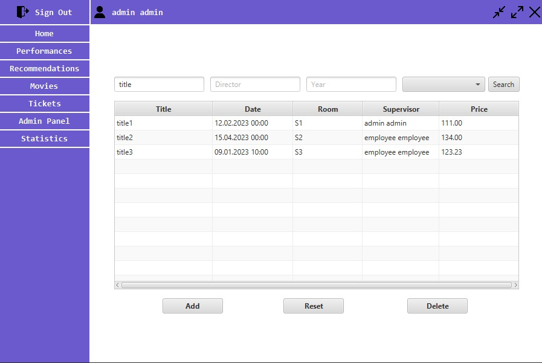

  Widok dostępny jest dla użytkowników z rolą admina/menadżera. \
  W tabeli wyświetlane są seanse obecnie zarejestrowane w bazie. \
  Seanse można wyświetlić w tabeli po uprzednim ich wyszukaniu \
  za pomocą odpowiednich pól u góry widoku i kliknięciu przycisku *Search*.\
  Przycisk *Reset* służy do czyszczenia tabeli z wyszukiwanych wyników. \
  Po wskazaniu seansu i wciśnięciu przycisku *Delete* zostaje on usunięty. \
  Po wciśnięciu przycisku *Add* otwiera się formularz dodawania nowego seansu.\
  Po dwukrotnym kliknięciu *Wiersza* otwiera się formularz edytowania seansu. \


  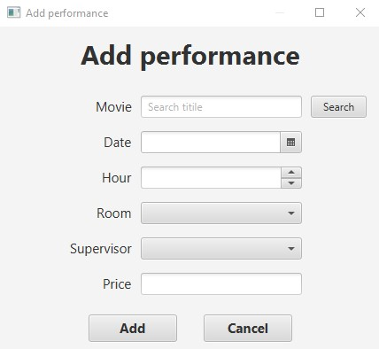

  Po poprawnym uzupełnieniu danych i wciśnięciu przycisku *Add* seans zostaje zatwierdzony.

  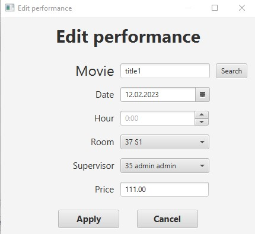

  Po poprawnym uzupełnieniu danych i wciśnięciu przycisku *Apply* seans zostaje zatwierdzony.

- **Rekomendacje**

  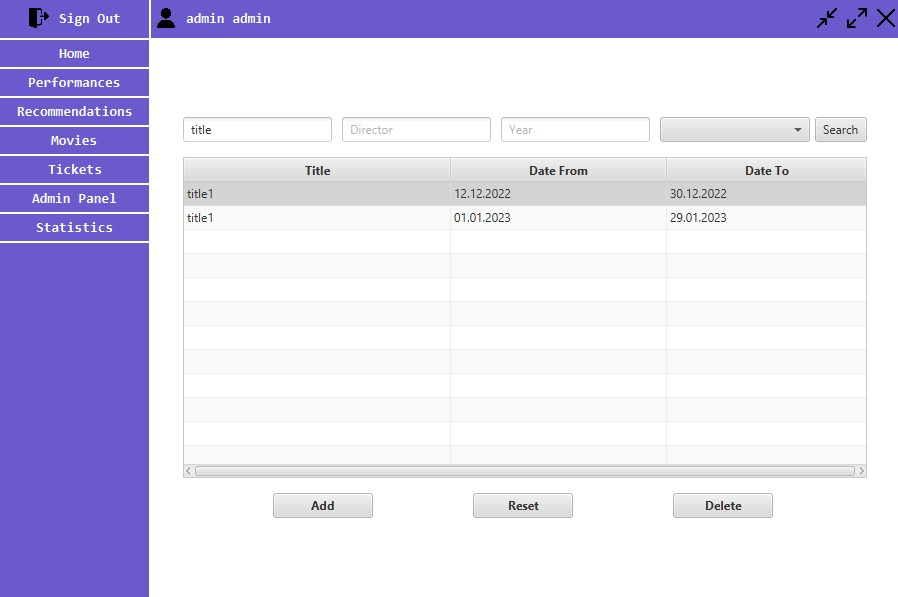

  Widok dostępny jest dla użytkowników z rolą admina/menadżera. \
  W tabeli wyświetlane są rekomendacje obecnie zarejestrowane w bazie. \
  Rekomendacje można wyświetlić w tabeli po uprzednim ich wyszukaniu \
  za pomocą odpowiednich pól u góry widoku i kliknięciu przycisku *Search*.\
  Przycisk *Reset* służy do czyszczenia tabeli z wyszukiwanych wyników. \
  Po wskazaniu rekomendacji i wciśnięciu przycisku *Delete* zostaje on usunięty. \
  Po wciśnięciu przycisku *Add* otwiera się formularz dodawania nowej rekomendacji.\
  Po dwukrotnym kliknięciu *Wiersza* otwiera się formularz edytowania rekomendacji.

  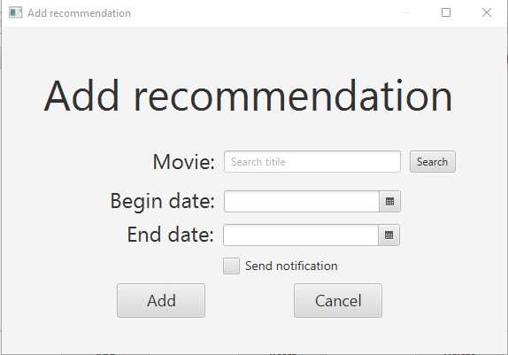

  Po poprawnym uzupełnieniu danych i wciśnięciu przycisku *Add* rekomendacja zostaje zatwierdzona.

  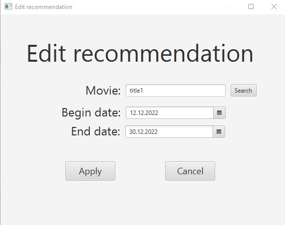

  Po poprawnym uzupełnieniu danych i wciśnięciu przycisku *Apply* rekomandacja zostaje zatwierdzona.

  Dla widoków dodawania i edycji rekomendacji oraz seansów:
  Po kliknięciu przycisku *Search* obok pola tekstowego z tytułem filmu można przejść do widoku wyszukiwania filmu.

  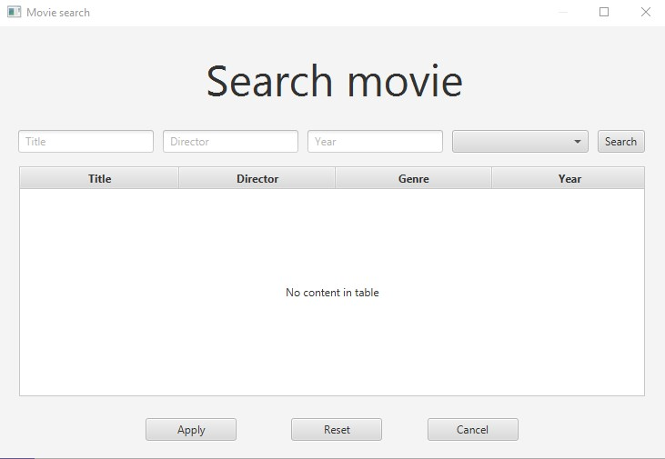

  Filmy można wyświetlić w tabeli po uprzednim ich wyszukaniu \
  za pomocą odpowiednich pól u góry widoku i kliknięciu przycisku *Search*.\
  Przycisk *Reset* służy do czyszczenia tabeli z wyszukiwanych wyników. \
  Przycisk *Apply* służy do dodania filmu do pola tekstowego. \
  Przycisk *Cancel* służy do wyjścia z widoku.


- **Bilety**

  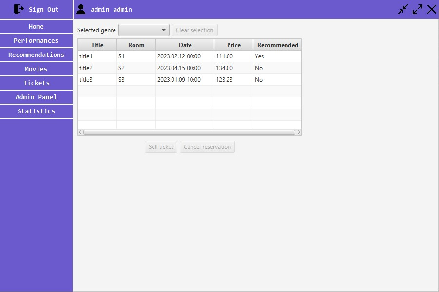
  
  Widok dostępny jest dla wszystkich użytkowników, niezależnie od roli. \
  Widok na początku wyświetla listę seansów, z których użytkownik wybiera jeden. \
  Za pomocą *Select genre* można wyświetlić tylko filmy z danej kategorii. \
  Wówczas wyświetli się tabela z nazwami poszczególych foteli w sali, w której odbędzie się seans.

  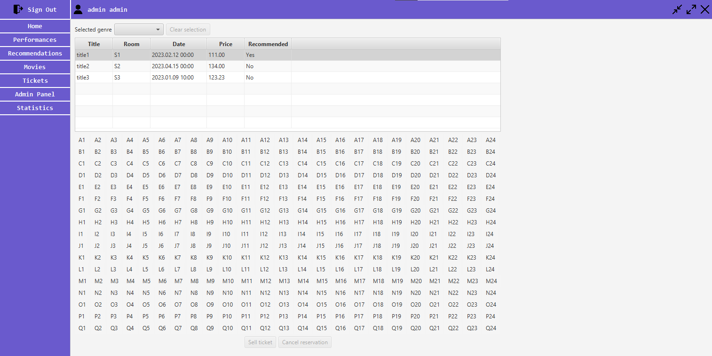

  Użytkownik wybiera odpowiedni fotel klikając w jego nazwę.

  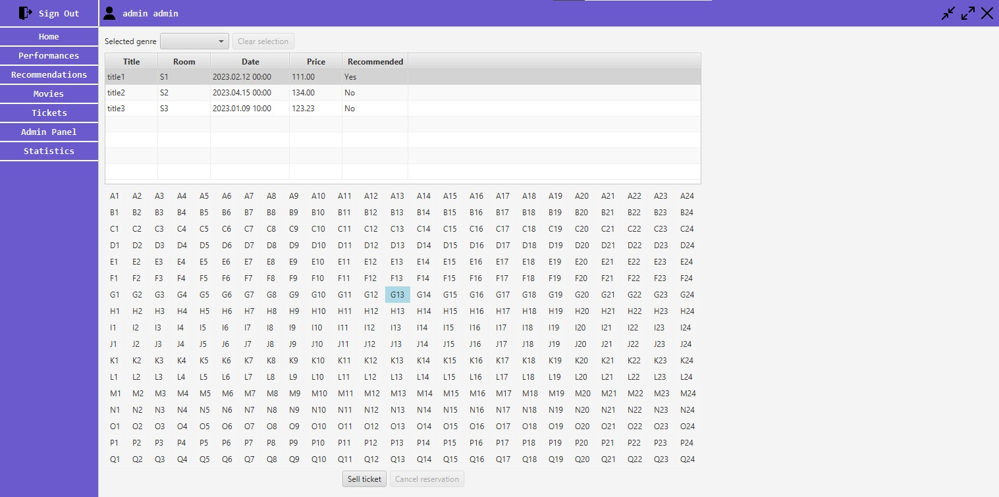

  Z pomocą przycisku "Sell ticket" użytkownik może sprzedać bilet na wybrany fotel w danym seansie.

  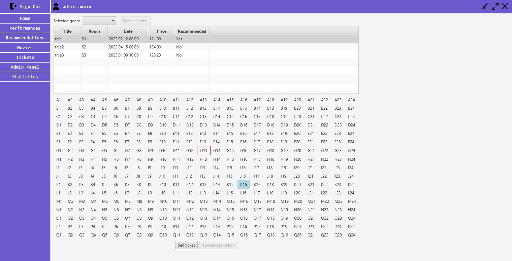

  Nazwa fotela jest obramowana na czerwono, co oznacza, że ten fotel jest zarezerwowany i nie da się sprzedać biletu na ten fotel i seans. \
  W przypadku zwrotu biletu, użytkownik może wybrać zarezerwowany fotel w celu realizacji zwrotu.

  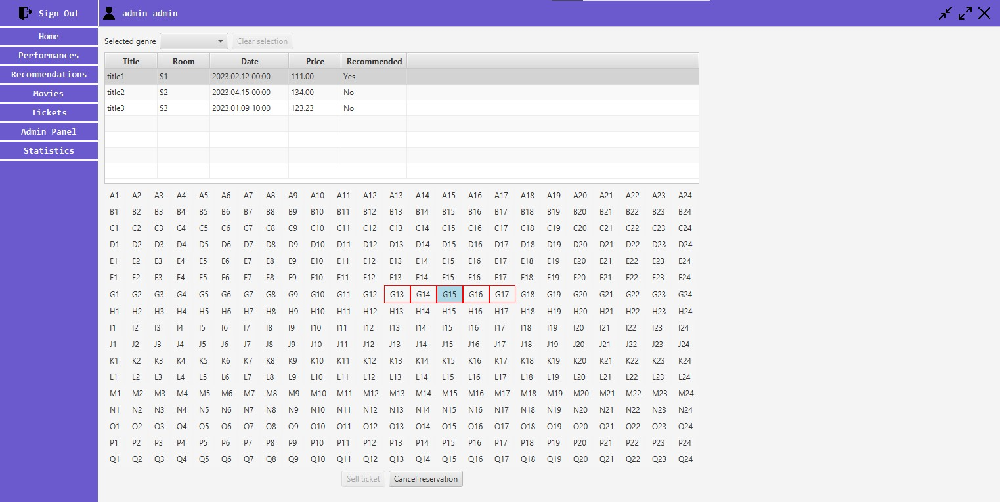

  Za pomocą przycisku "Cancel reservation" rezerwacja na fotel jest anulowana.

  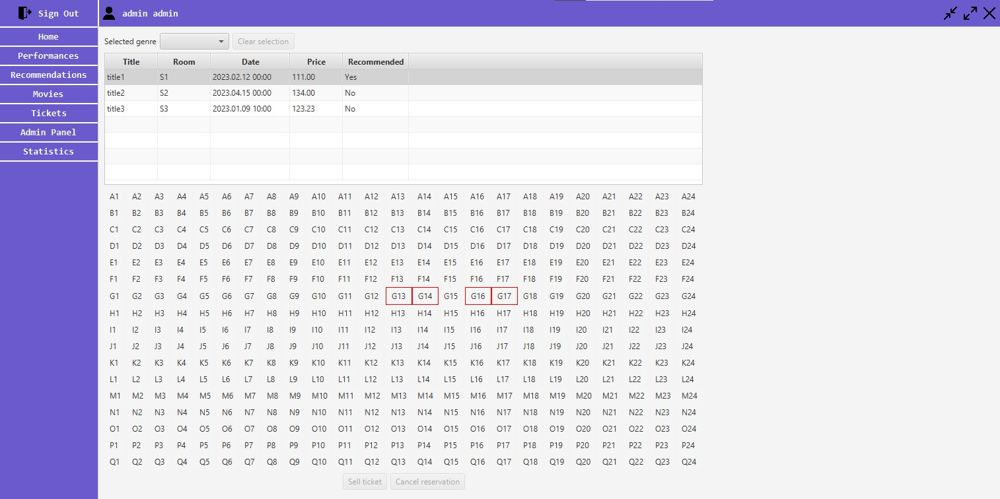

- **Statystyki**

  Dla Administratora i Menedżera dostępny jest widok statystyk podzielony na dwie części.
  
  Widok statystyk ogólnych pokazuje rozkład filmów oraz zaplanowanych seansów na poszczególne gatunki

  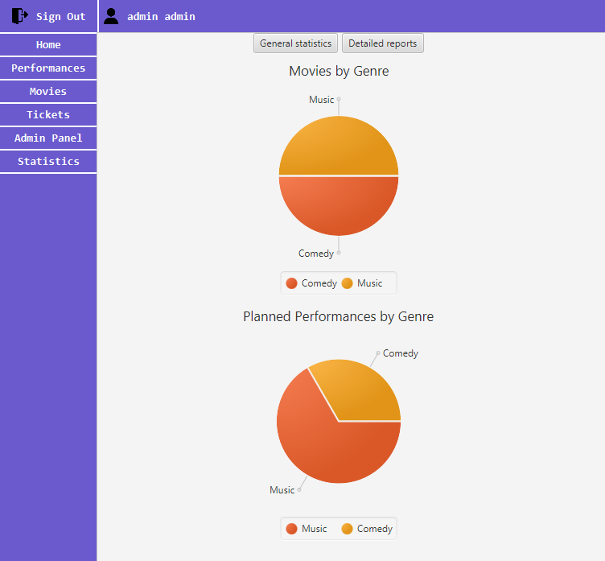

  Widok szczegółowych raportów pozwala użytkownikowi na wprowadzenie zakresu dni, z jakich należy wygenerować raport. Po naciśnięciu przycisku "Generate Reports" pojawią się wykresy przedstawiające liczbę sprzedanych biletów oraz sumę zysków za te bilety.

  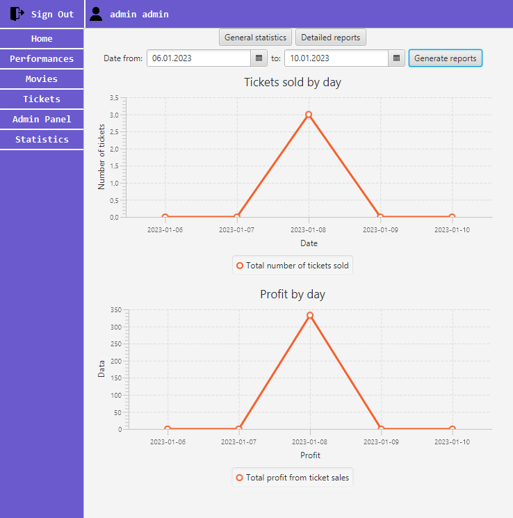

- **Panel administratora**

  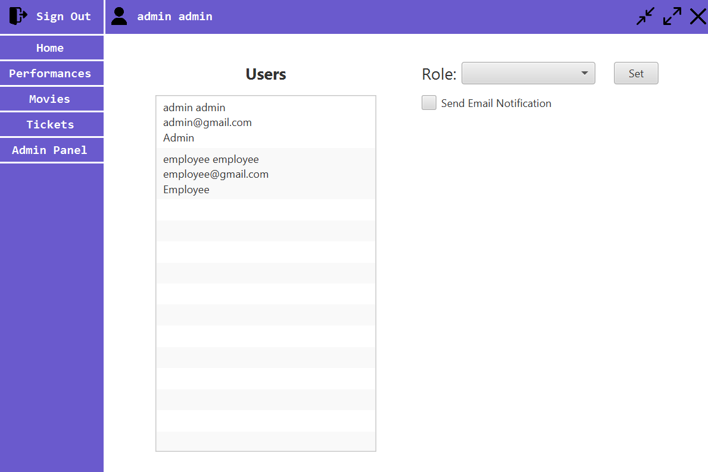

  Widok dostępny jest jedynie dla użytkownika z rolą administratora. \
  Administrator systemu może zmieniać rolę użytkowników wybierając ich z listy, a następnie po wyborze roli zatwierdzić ją przyciskiem *Set*. \
  Dodatkowo po zaznaczeniu *Send Email Notification* zostanie wysłany email do użytkownika powiadamiający go o zmianie jego roli.

<a name="instalacja"></a>
## Instalacja
```
git clone https://bitbucket.lab.ii.agh.edu.pl/scm/to2022/jk-pn-1300-cinemamak.git
```

<a name="uruchomienie"></a>
## Uruchomienie
Pierwszym krokiem jest uruchomienie bazy danych, która będzie działać w kontenerze.  
W katalogu głównym projektu wykonujemy polecenie:
```
docker compose -f .\src\main\resources\docker-compose.yml up -d
```
Następnie uruchamiamy aplikację:
```
./gradlew bootRun
```